# CloudForge Platform

Production-style DevOps/SRE project: a 3-tier online store (React, Apache, FastAPI, PostgreSQL, Redis) with Jenkins CI, Argo CD GitOps, Helm, Istio mTLS, canary/blue-green releases, Prometheus/Grafana/Loki, Terraform on AWS EKS and Ansible. The same Helm charts run **free on kind/minikube** or on **AWS EKS**; only values files differ.

## Architecture

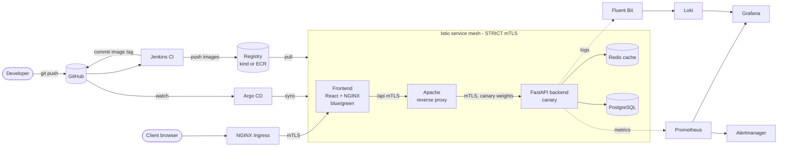

**Jenkins builds and tests, Git records the decision, Argo CD deploys, Istio secures traffic, Prometheus/Grafana/Loki show what is happening.**

## Technologies

| Area | Technology (role) |
|---|---|
| App | **React 19 + Vite 7** (storefront SPA), **FastAPI + Pydantic** (REST API, validation, `CF_*` config), **SQLAlchemy async + asyncpg** (DB access, row locks stop overselling), **redis-py** (read-through cache, failures never break requests), **Gunicorn + Uvicorn** (server), **prometheus-client + python-json-logger** (metrics, JSON logs) |
| Data | **PostgreSQL 17** (products, orders), **Redis 8** (disposable cache) |
| Web tier | **NGINX** (serves SPA, proxies `/api/`), **Apache httpd** (reverse proxy: path allow-list, request-ID, timeouts) |
| Testing | **pytest, httpx, aiosqlite, fakeredis** (backend), **vitest, Testing Library, ESLint** (frontend), **ruff** (lint), **SonarQube** (quality gate), **k6** (load), **kubeconform** (manifests), `smoke-test.sh` (e2e) |
| Containers | **Docker** (3 multi-stage non-root images), **Docker Compose** (local stack), **kind / minikube** (free clusters), local registry |
| Delivery | **Helm** (6 charts), **Argo CD + ApplicationSet + AppProject** (GitOps), **Argo Rollouts** (canary, blue/green), **Kustomize**, **Renovate** (dependency PRs) |
| CI/CD | **Jenkins + JCasC** (pipeline, commits image tag only), **GitHub Actions** (PR checks), **OWASP Dependency-Check**, **Trivy** (fs, IaC, image, SBOM), **yq**, **pre-commit + gitleaks** |
| Traffic | **NGINX Ingress** (edge, TLS, rate limit), **Istio + CNI** (mTLS, retries, canary weights), **Istio Gateway** (alternate edge), **cert-manager** (TLS certs), **ExternalDNS + AWS LB Controller** (DNS, NLBs on EKS), Cloudflare (optional) |
| Scaling | **metrics-server + HPA**, **VPA** (recommend only), **Cluster Autoscaler** (EKS), **PDB**, probes, Postgres backup **CronJob** |
| Security | **Pod Security Standards**, **NetworkPolicy**, **Istio AuthorizationPolicy**, **RBAC**, **ResourceQuota/LimitRange**, **External Secrets + Secrets Manager + KMS**, **EKS Pod Identity + access entries** |
| Observability | **Prometheus** (metrics, 19 alerts), **Grafana** (4 dashboards as code), **Loki + Fluent Bit** (logs), **Alertmanager**, postgres/redis/apache **exporters** |
| Infra | **Terraform** (modules: vpc, security-groups, iam, eks, ecr, s3, route53), **Ansible** (roles: docker, kubectl, helm, monitoring, jenkins), **AWS** (EKS, VPC, ECR, S3, Route 53, IAM, CloudWatch), Makefile + shell scripts |

## Runtime topology

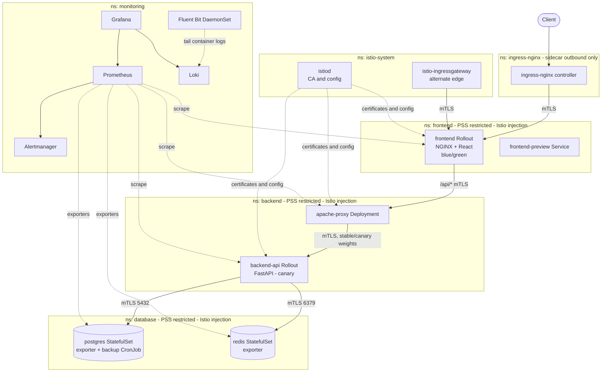

## Request flows

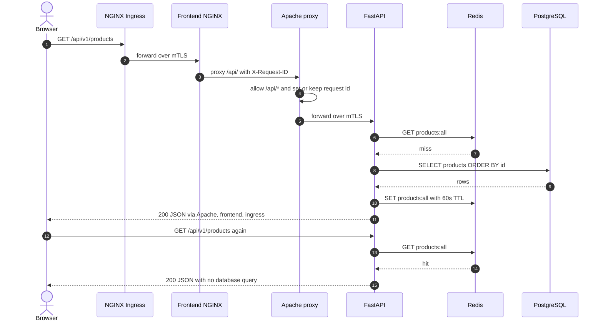

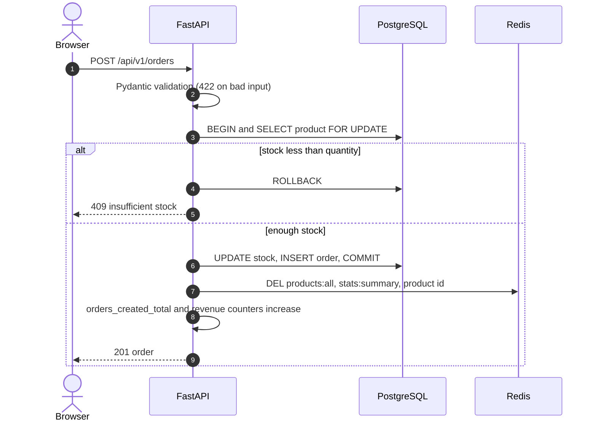


## CI/CD

CI builds, Git decides, Argo CD deploys. Jenkins never runs `kubectl` or `helm`. Image tag is `<git sha>-<build number>`. The promotion commit carries `[skip ci]`.

```mermaid
flowchart LR
    A[Developer git push] --> B[Jenkins Checkout]
    B --> C["Unit tests in parallel<br/>ruff + pytest | eslint + vitest + build"]
    C --> D[SonarQube scan]
    D --> E{Quality gate}
    E -->|red| X1([Build fails])
    E -->|green| F["Security scans in parallel<br/>OWASP Dependency-Check | Trivy fs + IaC"]
    F --> G["docker build x3 in parallel<br/>api, web, apache-proxy"]
    G --> H["Trivy image scan<br/>+ CycloneDX SBOM"]
    H --> I[Push images to registry<br/>main branch only]
    I --> J["helm lint, render,<br/>kubeconform"]
    J --> K["yq bumps image tag in<br/>gitops/environments/env"]
    K --> L["git commit with skip ci<br/>+ git push"]
    L --> M[Argo CD detects commit]
    M --> N{Rollout strategy}
    N -->|backend| O["Canary<br/>10, 25, 50, 100 percent<br/>Prometheus analysis"]
    N -->|frontend| P["Blue/green<br/>preview, smoke Job,<br/>manual promote"]
```

## GitOps

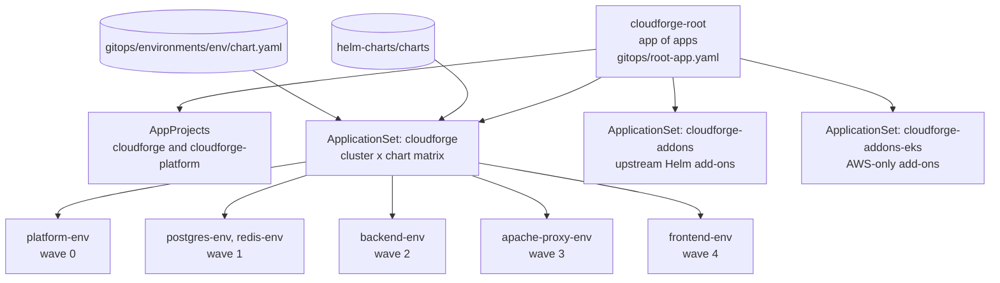

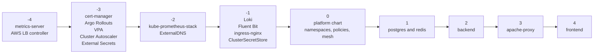

Rollback: canary failure is automatic; otherwise `git revert` the promotion commit.

## Release strategies

Backend uses canary (10, 25, 50, 100 % via Istio, gated by Prometheus success rate >= 99 % and p95 <= 500 ms). Frontend uses blue/green because a browser must not mix `index.html` and assets from different versions.

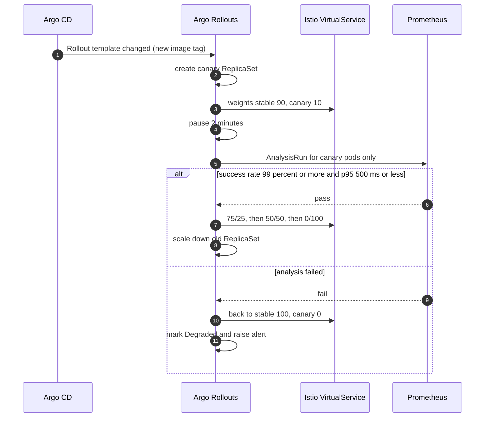

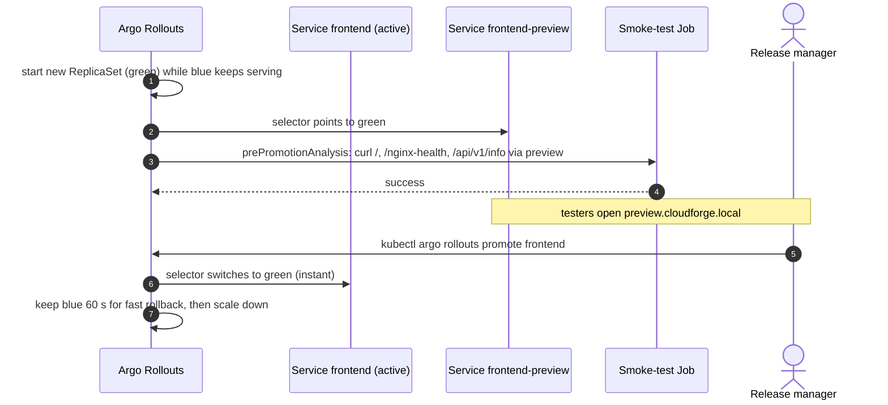

## Security

```mermaid
flowchart LR
    subgraph L1["1 - Supply chain"]
        s1[SonarQube quality gate]
        s2[OWASP Dependency-Check]
        s3[Trivy fs, IaC, image]
        s4[CycloneDX SBOM]
        s5[ECR immutable tags and scan on push]
        s6[gitleaks pre-commit]
    end
    subgraph L2["2 - Cluster admission"]
        a1[Pod Security Standards restricted]
        a2[ResourceQuota and LimitRange]
        a3["non-root, read-only rootfs,<br/>drop ALL caps, seccomp"]
    end
    subgraph L3["3 - Network"]
        n1[NetworkPolicy default-deny<br/>plus explicit allows]
        n2[Istio STRICT mTLS]
        n3[AuthorizationPolicy deny-all<br/>plus SPIFFE identity allows]
    end
    subgraph L4["4 - Identity and secrets"]
        i1[RBAC roles]
        i2[EKS access entries]
        i3[Pod Identity per controller]
        i4[Secrets Manager to External Secrets]
        i5[KMS envelope encryption]
    end
    L1 --> L2 --> L3 --> L4
```

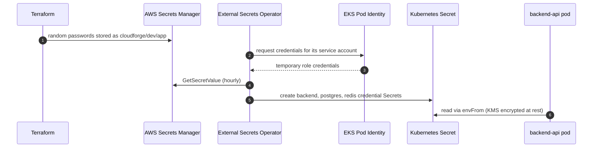

## Observability

SLO: 99.5 % success, p95 < 500 ms. `X-Request-ID` links a request to its logs across tiers. Alert runbooks: [docs/runbooks.md](docs/runbooks.md).

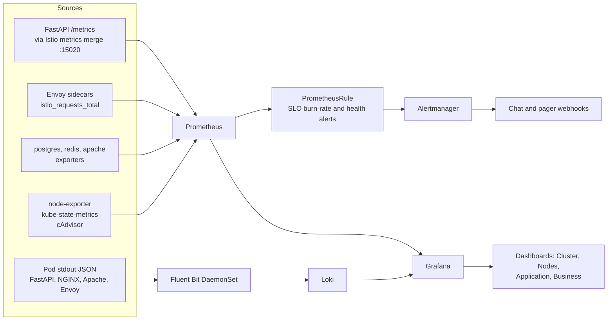

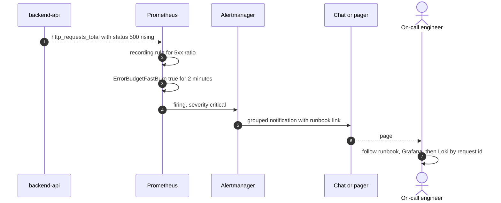

## AWS and provisioning

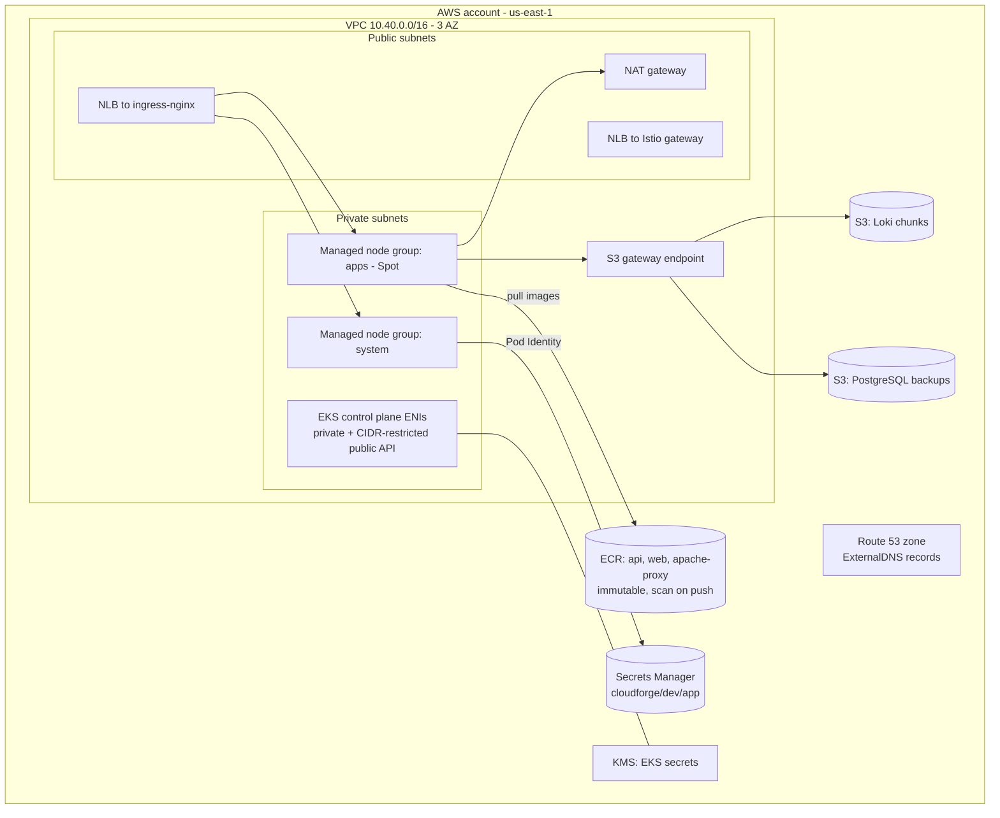

EKS costs about $8-12/day: run `make eks-down` after demos.

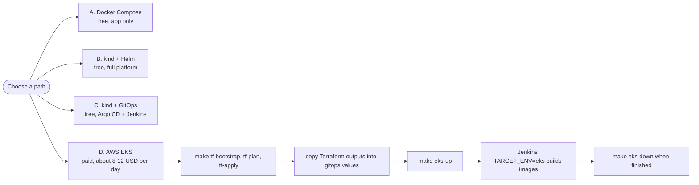

## Quick start

```bash
cp .env.example .env && docker compose up --build -d   # A. app only: http://localhost:3000
make kind-up && make smoke && make canary              # B. full platform on kind (free)
make kind-gitops                                       # C. kind + Argo CD
make tf-bootstrap tf-plan tf-apply eks-up              # D. AWS EKS (paid)
make eks-down                                          # tear down
```

Windows: run in WSL2. `make help` lists all targets. Docs: [`docs/`](docs/) (architecture, setup, CI/CD, strategies, observability, security, runbooks).

**Known trade-offs:** ingress-nginx is past community end-of-maintenance (Istio Gateway is the migration target); Jenkins mounts the Docker socket (local lab only); PostgreSQL/Redis are single-replica (use RDS/ElastiCache in production); EKS values contain placeholders (account ID, domain) to replace with Terraform outputs.
