# Peak DevOps

Production-style DevOps/SRE portfolio project: a small 3-tier online store (React, Apache,
FastAPI, PostgreSQL, Redis) delivered with Jenkins CI, Argo CD GitOps, Helm, Istio mTLS,
canary and blue/green releases, Prometheus/Grafana/Loki observability, Terraform on AWS EKS and
Ansible. The same Helm charts run **free on kind/minikube** and on **AWS EKS**; only the values files differ.

**Contents:** [Architecture](#1-architecture) · [Technologies](#2-technologies) · [Runtime](#3-runtime-topology) · [Request flows](#4-request-flows) · [CI/CD](#5-cicd) · [GitOps](#6-gitops) · [Releases](#7-release-strategies) · [Security](#8-security) · [Observability](#9-observability) · [AWS](#10-aws-and-provisioning) · [Quick start](#11-quick-start) · [Docs](#12-docs-and-layout)

---

## 1. Architecture


**Jenkins builds and tests, Git records the decision, Argo CD deploys, Istio secures traffic, Prometheus/Grafana/Loki show what is happening.**

---

## 2. Technologies

### Application

| Technology | Role in CloudForge |
|---|---|
| React 19, Vite 7 | Storefront SPA (catalogue, buy, add product, orders); Vite bundles it with hashed assets |
| FastAPI, Pydantic, pydantic-settings | REST API, input validation (422), `CF_*` env-var config |
| SQLAlchemy 2 (async), asyncpg | PostgreSQL access; `SELECT ... FOR UPDATE` prevents overselling |
| redis-py | Read-through cache (60 s products, 15 s stats); cache failures never fail a request |
| Gunicorn + Uvicorn | Production server, one worker per pod (scale with HPA) |
| prometheus-client, python-json-logger | `/metrics` (RED + business counters) and JSON logs |
| PostgreSQL 17 | Products and orders (seeded from `db/init.sql`) |
| Redis 8 | Disposable cache (`allkeys-lru`, password, no persistence) |
| NGINX (unprivileged) | Serves React build, security headers, proxies `/api/` to Apache |
| Apache httpd 2.4 | Reverse proxy: `/api/*` allow-list, `X-Request-ID`, timeouts, pooling |

### Testing and quality

| Technology | Role |
|---|---|
| pytest, httpx, aiosqlite, fakeredis | Backend tests with SQLite and fake Redis, no services needed |
| vitest, Testing Library, jsdom, ESLint | Frontend tests and lint |
| ruff | Python lint/format including security rules |
| SonarQube | Static analysis and pipeline quality gate |
| k6 | Load test to drive autoscaling and check SLOs |
| kubeconform, `smoke-test.sh` | Manifest validation; 11 end-to-end checks |

### Containers and local runtime

| Technology | Role |
|---|---|
| Docker | Three multi-stage, non-root images (`api`, `web`, `apache-proxy`) |
| Docker Compose | Local full stack; `data` network is internal; optional Prometheus/Grafana profile |
| kind, minikube (Calico) | Free local Kubernetes clusters |
| Local registry | `localhost:5001` image registry for kind and Jenkins |

### Kubernetes and delivery

| Technology | Role |
|---|---|
| Kubernetes 1.34 | Runtime: Deployments, StatefulSets, Services, Ingress, HPA, PDB, NetworkPolicy, CronJob, RBAC, quotas |
| Helm 3 | Six charts: `frontend`, `backend`, `apache-proxy`, `postgres`, `redis`, `platform` |
| Argo CD 3 (+ ApplicationSet, AppProject) | GitOps: cluster follows Git; one Application per cluster x chart; permission boundaries |
| Argo Rollouts | Canary (backend) and blue/green (frontend) with metric analysis |
| Kustomize | Wraps rendered manifests per environment |
| Renovate | Opens PRs for dependency, image and chart updates |

### Traffic and edge

| Technology | Role |
|---|---|
| NGINX Ingress | Public entry: host routing, TLS, rate limit, JSON access logs |
| Istio 1.27 (+ CNI) | STRICT mTLS, retries, outlier detection, weighted canary routing; CNI keeps pods unprivileged |
| Istio Gateway | Alternate mesh-native edge, migration path from ingress-nginx |
| cert-manager | Issues and renews TLS certs (Let's Encrypt) |
| ExternalDNS, AWS LB Controller (EKS) | Route 53 records and NLBs from Kubernetes objects |
| Cloudflare (optional) | DNS/CDN in front of the edge |

### Scaling and reliability

| Technology | Role |
|---|---|
| metrics-server, HPA | Scale backend, Apache, frontend on CPU/memory |
| VPA | Recommendation-only sizing (does not fight HPA) |
| Cluster Autoscaler (EKS) | Adds/removes nodes |
| PodDisruptionBudget, probes | Availability during drains; startup/liveness/readiness checks |
| Postgres backup CronJob | Nightly `pg_dump`, 7-day retention |

### CI/CD and scanning

| Technology | Role |
|---|---|
| Jenkins LTS + JCasC | CI pipeline; only writes a Git commit, never deploys directly |
| GitHub Actions | Lightweight PR checks (lint, tests, helm lint, terraform validate) |
| OWASP Dependency-Check | Vulnerable libraries; fails at CVSS 9+ |
| Trivy | Filesystem, IaC and image scans; CycloneDX SBOM |
| yq | Bumps image tags in GitOps values |
| pre-commit, gitleaks | Local secret scanning and lint hooks |

### Cluster security

| Technology | Role |
|---|---|
| Pod Security Standards (`restricted`) | Rejects root or privileged pods |
| NetworkPolicy, Istio AuthorizationPolicy | Default-deny at network and identity level |
| RBAC, ResourceQuota, LimitRange | Least-privilege roles, per-namespace caps |
| External Secrets, Secrets Manager, KMS | Secrets synced from AWS, encrypted at rest |
| EKS Pod Identity, access entries | Per-controller AWS roles without static keys; kubectl access mapping |

### Observability

| Technology | Role |
|---|---|
| Prometheus (kube-prometheus-stack) | Metrics, recording and alert rules (19 alerts, SLO burn-rate) |
| Grafana | Four dashboards as code (Cluster, Nodes, Application, Business) |
| Loki + Fluent Bit | Log storage and shipping |
| Alertmanager | Routes alerts to chat/pager |
| postgres, redis, apache exporters | Dependency metrics via sidecars |

### Infrastructure as code and cloud

| Technology | Role |
|---|---|
| Terraform >= 1.10 | Seven modules: `vpc`, `security-groups`, `iam`, `eks`, `ecr`, `s3`, `route53`; S3 remote state |
| Ansible | Roles `docker`, `kubectl`, `helm`, `monitoring`, `jenkins` to set up workstations and CI |
| AWS EKS, VPC, ECR, S3, Route 53, IAM, CloudWatch | Cluster, network, images, state/logs/backups, DNS, roles, audit logs |
| Makefile, shell scripts | One-command bootstrap, teardown, render, smoke test, canary demo |

---

## 3. Runtime topology


Apache is a gateway tier (path allow-list, request-ID, timeouts). Redis is a soft dependency: the API falls back to PostgreSQL.

---

## 4. Request flows

**Browse (cache miss then hit)**

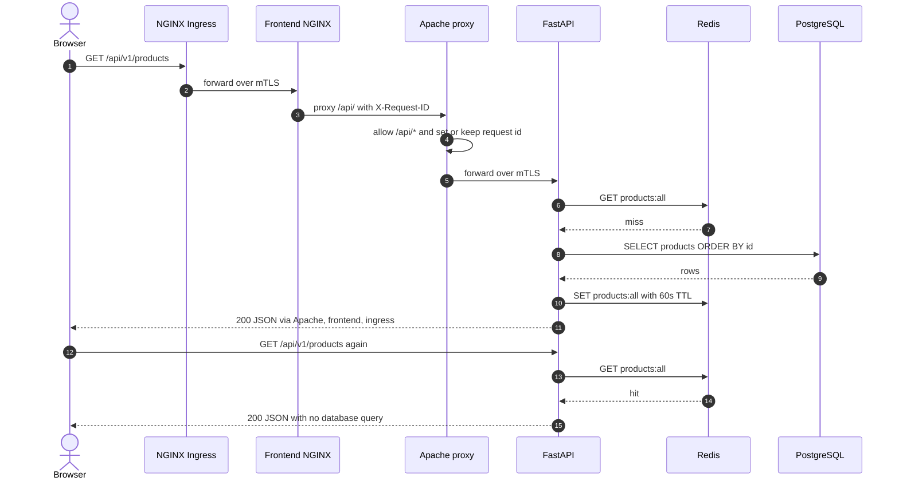

**Checkout (concurrency-safe)**

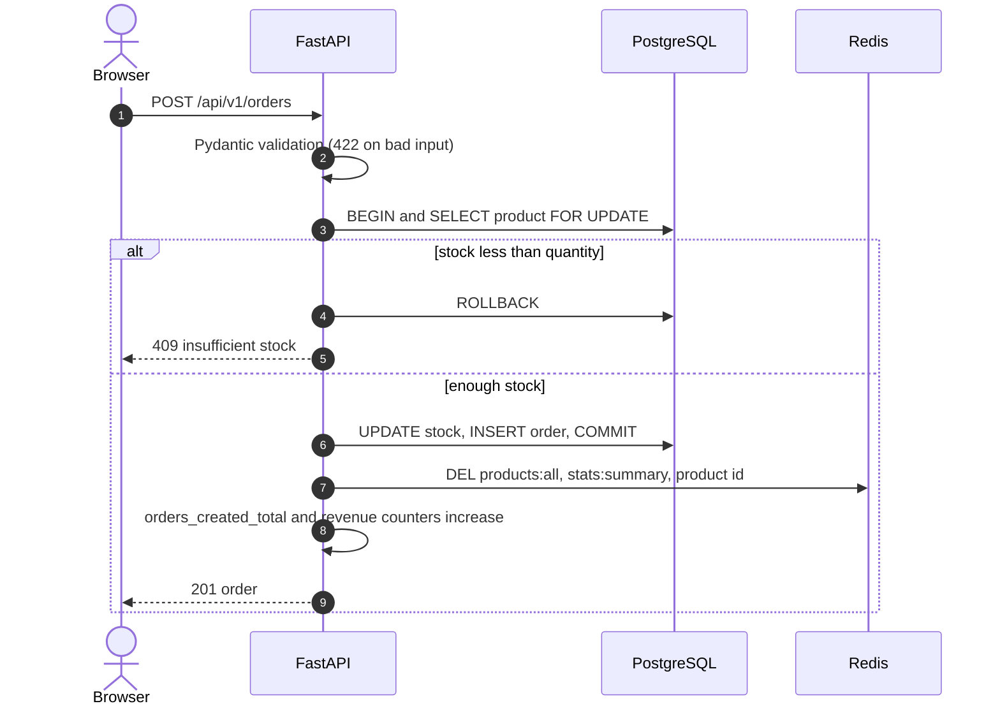

**Local Docker Compose network layout**

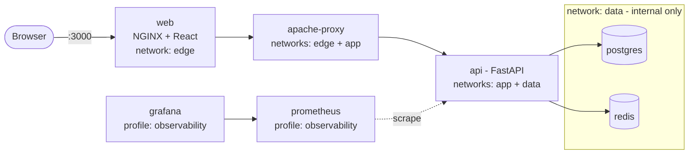

Endpoints: `GET /api/v1/products`, `/products/{id}`, `/stats`, `/info`, `/orders`; `POST /api/v1/products`, `/orders`; probes `/healthz` (liveness) and `/readyz` (database reachable); `/metrics`.

---

## 5. CI/CD

Principles: **CI builds, Git decides, Argo CD deploys** (Jenkins never runs `kubectl`/`helm`); image tag is `<git sha>-<build number>`; scans run before push; one chart, values per environment.


Stages fail on: lint/test failure, red SonarQube gate, dependency CVSS >= 9, HIGH/CRITICAL Trivy findings, invalid Helm/manifests. The promotion commit carries `[skip ci]` to avoid a build loop.

---

## 6. GitOps

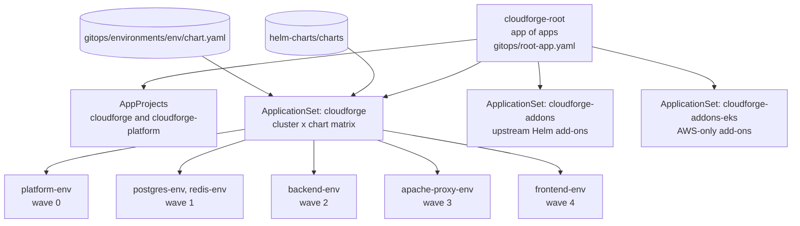

A cluster opts in with the label `cloudforge.dev/env=local|eks`. A new environment is just a values folder plus a labelled cluster.

**Sync order**

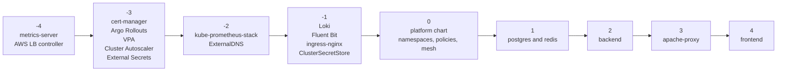

`ignoreDifferences` lets HPA own replicas and Argo Rollouts own VirtualService weights and blue/green selectors.

**Rollback:** canary failure is automatic; otherwise `git revert` the promotion commit; frontend can also `kubectl argo rollouts undo` within 60 s.

---

## 7. Release strategies

| Workload | Strategy | Gate |
|---|---|---|
| backend-api | Canary 10, 25, 50, 100 % via Istio weights | Prometheus: success >= 99 %, p95 <= 500 ms |
| frontend | Blue/green (Service selector swap) | Smoke-test Job, then manual promote |
| apache-proxy | Rolling update, `maxUnavailable: 0` | Readiness probe |
| postgres, redis | StatefulSet rolling update | Readiness probe, PDB |

**Backend canary**

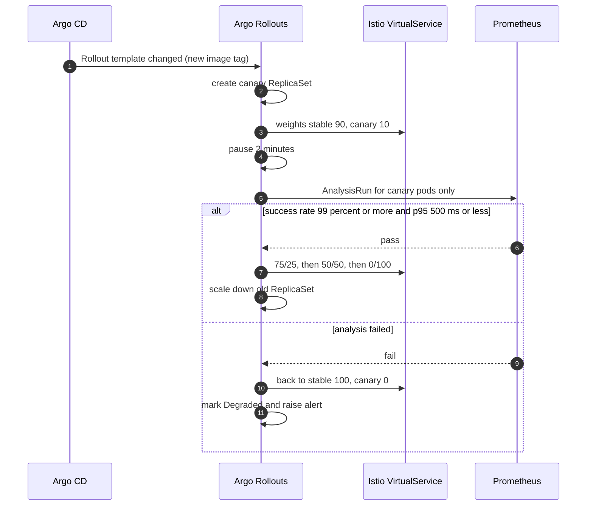

**Frontend blue/green**

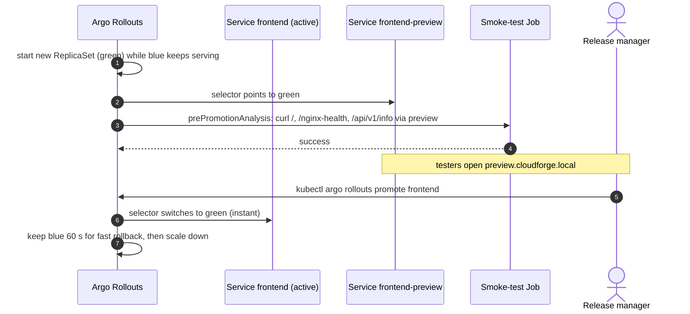

**Why the difference:** API requests are independent, so a small traffic share gives a valid signal. A browser loads `index.html` plus hashed assets, and mixing versions could break the page, so the frontend switches atomically.

---

## 8. Security

```mermaid
flowchart LR
    subgraph L1["1 - Supply chain"]
        s1[SonarQube quality gate]
        s2[OWASP Dependency-Check]
        s3[Trivy fs, IaC, image]
        s4[CycloneDX SBOM]
        s5[ECR immutable tags and scan on push]
        s6[gitleaks pre-commit]
    end
    subgraph L2["2 - Cluster admission"]
        a1[Pod Security Standards restricted]
        a2[ResourceQuota and LimitRange]
        a3["non-root, read-only rootfs,<br/>drop ALL caps, seccomp"]
    end
    subgraph L3["3 - Network"]
        n1[NetworkPolicy default-deny<br/>plus explicit allows]
        n2[Istio STRICT mTLS]
        n3[AuthorizationPolicy deny-all<br/>plus SPIFFE identity allows]
    end
    subgraph L4["4 - Identity and secrets"]
        i1[RBAC roles]
        i2[EKS access entries]
        i3[Pod Identity per controller]
        i4[Secrets Manager to External Secrets]
        i5[KMS envelope encryption]
    end
    L1 --> L2 --> L3 --> L4
```

Everything not explicitly allowed is denied twice (NetworkPolicy and AuthorizationPolicy). Containers run non-root with read-only filesystem, dropped capabilities and seccomp. Allowed-traffic matrix: [docs/security.md](docs/security.md).

**Secrets on EKS**

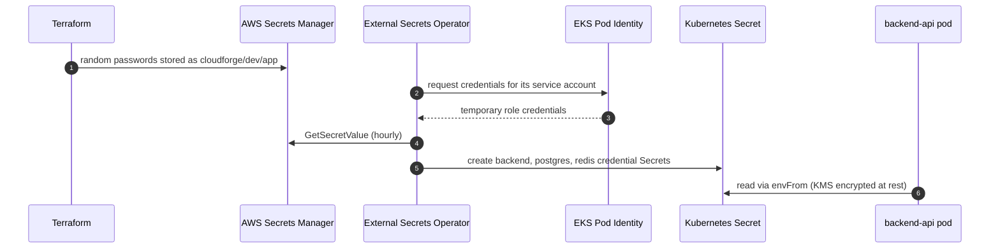

Locally, random credentials are generated at bootstrap and never written to Git.

---

## 9. Observability

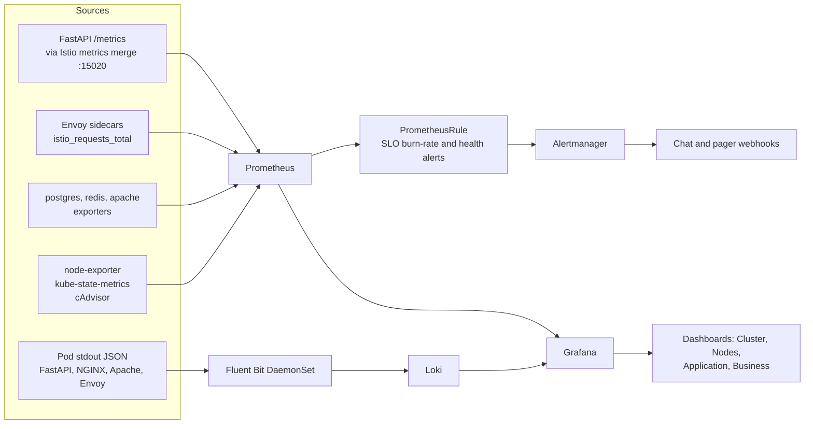

`X-Request-ID` is created by Apache if missing and logged by every tier, so Grafana links a request to its Loki logs. SLO: 99.5 % of requests succeed and p95 < 500 ms. Burn-rate alerts: 14.4x over 5 m and 1 h pages; 6x over 1 h and 6 h opens a ticket. Each alert has a runbook in [docs/runbooks.md](docs/runbooks.md).

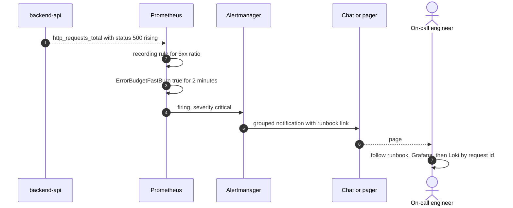

---

## 10. AWS and provisioning

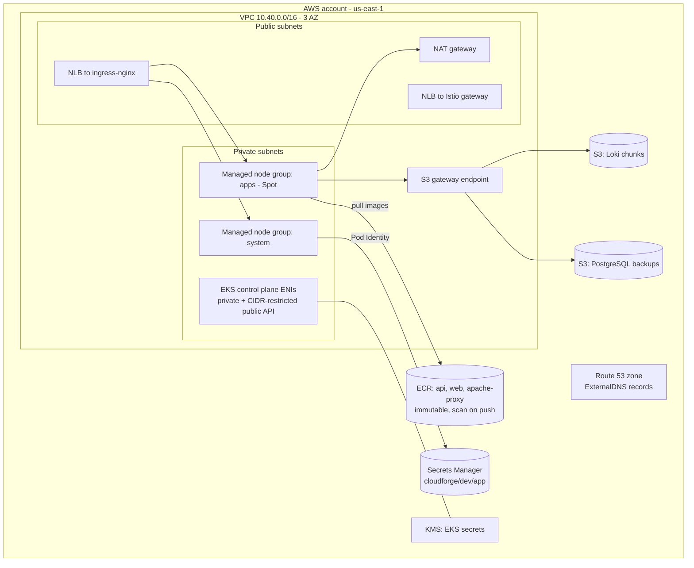

Terraform builds this from the seven modules; Ansible installs tools and Jenkins. `make eks-down` removes load balancers and volumes before `terraform destroy`; EKS costs roughly $8-12/day.


---

## 11. Quick start

```bash
# A. Just the app (Docker only)
cp .env.example .env && docker compose up --build -d            # http://localhost:3000

# B. Full platform on kind (free)
make kind-up                                                     # ~10 min first time
echo "127.0.0.1 cloudforge.local preview.cloudforge.local" | sudo tee -a /etc/hosts
make smoke && make canary                                        # e2e test, then canary + blue/green demo

# C. kind with Argo CD in control (repo must be on GitHub)
make kind-gitops

# D. AWS EKS (paid, see docs/setup-eks.md)
make tf-bootstrap tf-plan tf-apply eks-up
make eks-down                                                    # always tear down after a demo
```

On Windows run the bash commands in WSL2. `make help` lists every target.

---

## 12. Docs and layout

Docs: [architecture](docs/architecture.md) · [sequence diagrams](docs/sequence-diagrams.md) · [local setup](docs/setup-local.md) · [EKS setup](docs/setup-eks.md) · [CI/CD and GitOps](docs/cicd-and-gitops.md) · [deployment strategies](docs/deployment-strategies.md) · [observability](docs/observability.md) · [security](docs/security.md) · [runbooks](docs/runbooks.md)

```
cloudforge/
├── app-backend/  app-frontend/  apache-proxy/   application tiers + Dockerfiles + tests
├── db/init.sql · docker-compose.yml             local stack and schema
├── Jenkinsfile · jenkins/                       CI pipeline, Jenkins/SonarQube stack (JCasC)
├── helm-charts/charts/                          frontend, backend, apache-proxy, postgres, redis, platform
├── gitops/                                      Argo CD roots, projects, ApplicationSets, add-on and env values
├── k8s-manifests/                               rendered YAML, Istio operator config, bootstrap
├── monitoring/                                  Prometheus stack, Loki, Fluent Bit, dashboards-as-code
├── infra-terraform/  infra-ansible/             AWS infrastructure, tool provisioning
├── scripts/ · security/ · docs/                 bootstrap, smoke/load tests, scan config, documentation
└── Makefile · renovate.json · .pre-commit-config.yaml · .github/workflows/ci.yml
```

**Versions** (pinned per tool, bumped by Renovate): Python 3.13, FastAPI 0.118, Node 24, React 19, PostgreSQL 17, Redis 8.2, Kubernetes 1.34, Istio 1.27, Argo CD 3.1, Argo Rollouts 1.8, Terraform >= 1.10, AWS provider ~> 6.14.

**Start reading here:** `helm-charts/charts/backend/templates/{rollout,istio,analysistemplate}.yaml` (canary), `helm-charts/charts/platform/templates/` (zero-trust baseline), `Jenkinsfile`, `gitops/argocd/applicationsets/cloudforge-apps.yaml`, `infra-terraform/modules/eks`.

**Known trade-offs:** ingress-nginx is past community end-of-maintenance (kept per blueprint; Istio Gateway is the migration target). Jenkins mounts the Docker socket (local lab only). PostgreSQL and Redis are single-replica in-cluster (use RDS/ElastiCache in production). EKS values hold placeholders (account ID, domain, zone ID) to replace with Terraform outputs.
