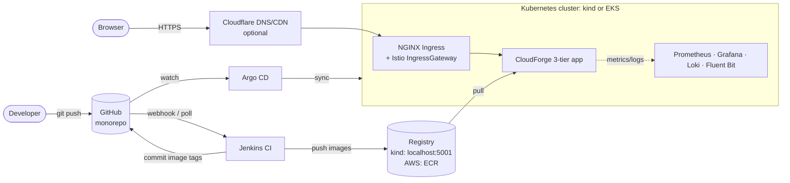
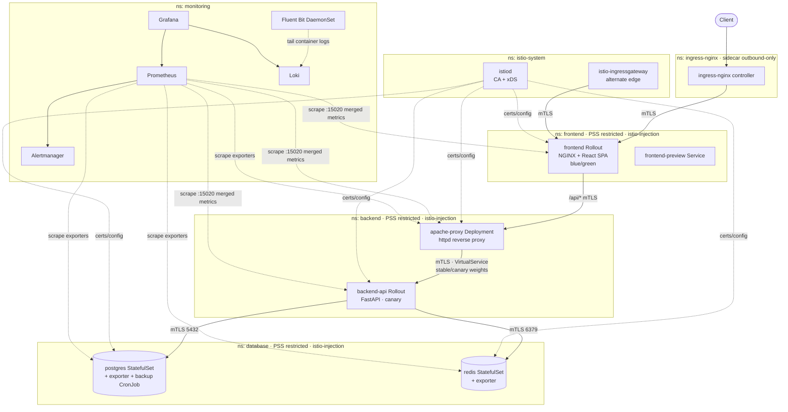
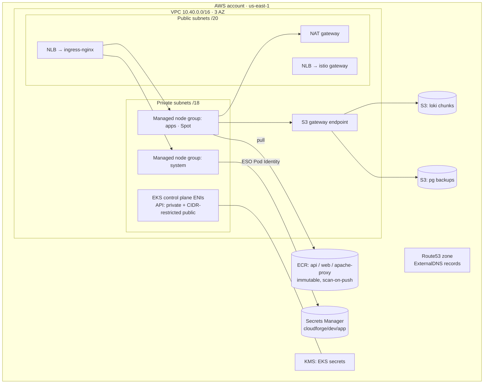
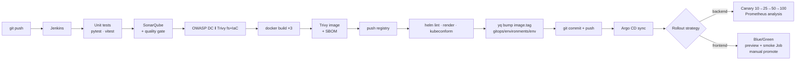

# Architecture

CloudForge is a 3-tier storefront (React → Apache → FastAPI → PostgreSQL/Redis) running on
Kubernetes with an Istio mesh, GitOps delivery and a full observability stack. The same Helm
charts deploy to a free local kind cluster and to AWS EKS; only the values files differ.

## 1. System context

## 2. Runtime topology (namespaces, tiers, mesh)

**Why each hop exists**

| Hop | Responsibility |
|---|---|
| NGINX Ingress | Public entry, TLS termination (cert-manager), rate limiting, JSON access logs. Joined to the mesh for outbound mTLS only. |
| Istio IngressGateway | Alternate, mesh-native edge (Gateway + VirtualService); on EKS behind its own NLB. |
| Frontend NGINX | Serves the static React build with security headers; proxies `/api/` to Apache so the browser uses one origin (no CORS). |
| Apache reverse proxy | API gateway tier: path allow-listing (`/api/*` only), request-ID generation/propagation, header hygiene, timeouts, connection pooling, JSON logs. |
| FastAPI | Business logic, RED + business metrics, structured logs, readiness that checks Postgres. |
| Redis | Read-through cache (soft dependency — API degrades to Postgres on cache failure). |
| PostgreSQL | System of record; row-level locking prevents overselling. |

## 3. Security layers

```mermaid
flowchart LR
    subgraph L1[Supply chain]
        s1[SonarQube quality gate]
        s2[OWASP Dependency-Check]
        s3[Trivy fs / IaC / image]
        s4[SBOM CycloneDX]
        s5[Immutable ECR tags + scan on push]
    end
    subgraph L2[Cluster admission]
        a1[Pod Security Standards: restricted]
        a2[ResourceQuota + LimitRange]
        a3[non-root, read-only rootfs,<br/>drop ALL caps, seccomp]
    end
    subgraph L3[Network]
        n1[NetworkPolicy default-deny<br/>+ explicit allows]
        n2[Istio STRICT mTLS]
        n3[AuthorizationPolicy deny-all<br/>+ SPIFFE principal allows]
    end
    subgraph L4[Identity & secrets]
        i1[RBAC: viewer / developer / CI read-only]
        i2[EKS access entries]
        i3[Pod Identity per controller]
        i4[Secrets Manager → External Secrets]
        i5[KMS envelope encryption]
    end
    L1 --> L2 --> L3 --> L4
```

## 4. AWS infrastructure (EKS path)

Terraform modules (`infra-terraform/modules`): `vpc`, `security-groups`, `iam`, `eks`, `ecr`,
`s3`, `route53`, composed in `environments/dev`. State lives in S3 with native lockfiles.

## 5. Delivery pipeline

## 6. Repository layout ↔ blueprint repositories

The blueprint lists eight repositories; this monorepo keeps them as top-level folders so the
whole platform is reviewable in one place. Splitting later is a `git filter-repo` per folder.

| Blueprint repo | Folder |
|---|---|
| app-frontend | `app-frontend/` |
| app-backend | `app-backend/` (+ `apache-proxy/`) |
| helm-charts | `helm-charts/charts/{frontend,backend,apache-proxy,postgres,redis,platform}` |
| k8s-manifests | `k8s-manifests/` (rendered + Istio/EKS/bootstrap YAML) |
| gitops | `gitops/` (Argo CD projects, ApplicationSets, env values) |
| monitoring | `monitoring/` (Prometheus stack, Loki, Fluent Bit, dashboards-as-code) |
| infra-terraform | `infra-terraform/` |
| infra-ansible | `infra-ansible/` |
