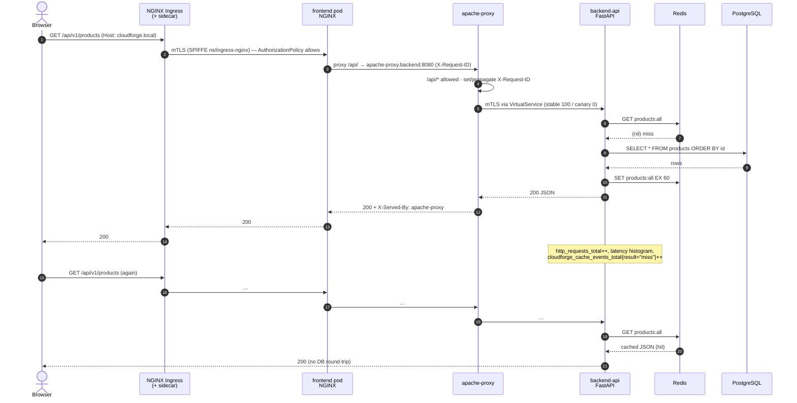
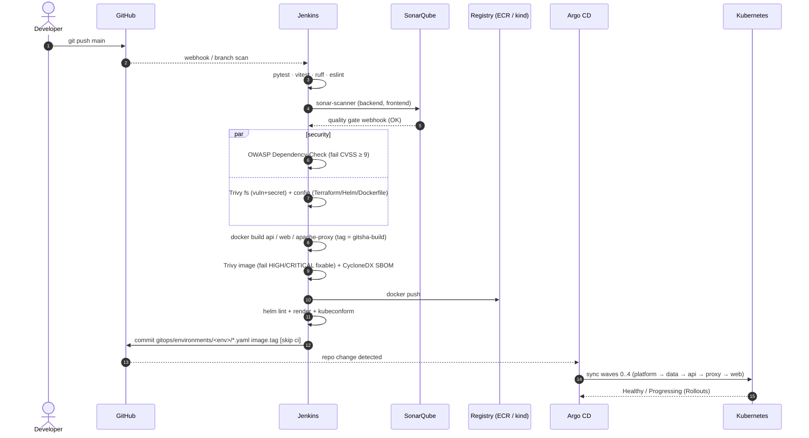
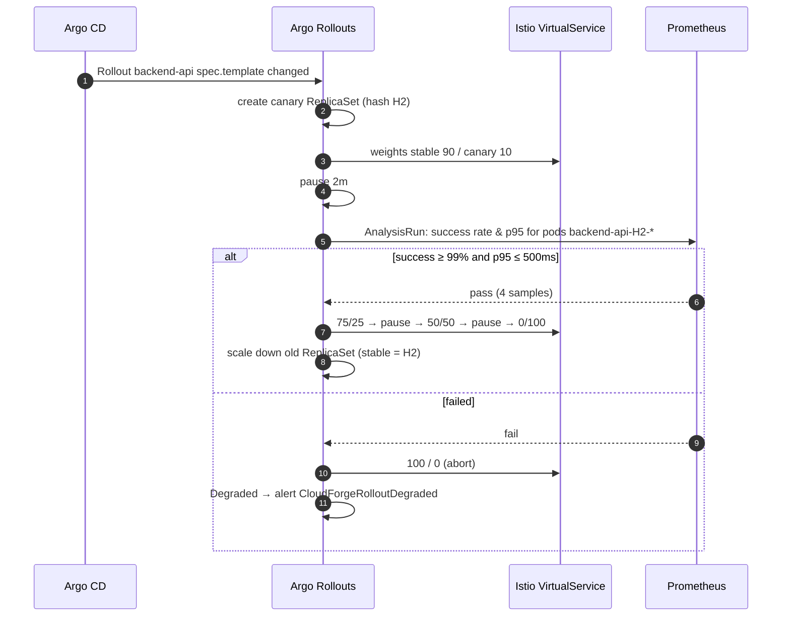
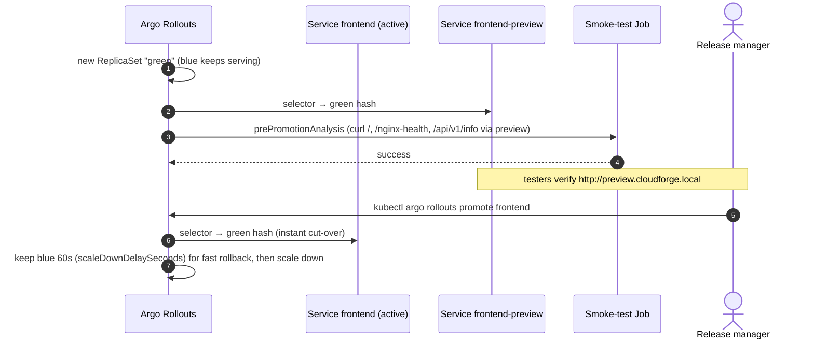
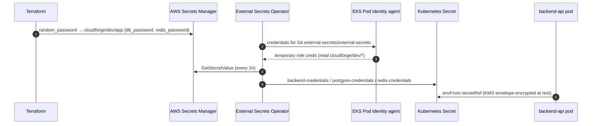
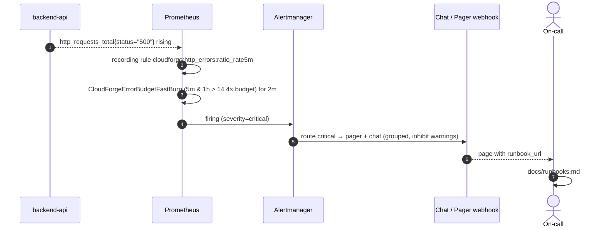

# Sequence diagrams

## 1. Browse catalog (cache miss, then hit)



## 2. Checkout (order creation, concurrency-safe)

```mermaid
sequenceDiagram
    autonumber
    actor U as Browser
    participant API as backend-api
    participant P as PostgreSQL
    participant R as Redis
    U->>API: POST /api/v1/orders {product_id, quantity, email}
    API->>API: Pydantic validation (422 on bad input)
    API->>P: BEGIN; SELECT … FROM products WHERE id=$1 FOR UPDATE
    alt stock < quantity
        API->>P: ROLLBACK
        API-->>U: 409 insufficient stock
    else enough stock
        API->>P: UPDATE products SET stock = stock - q; INSERT INTO orders …; COMMIT
        API->>R: DEL products:all stats:summary product:{id}
        API->>API: orders_created_total{product}++, revenue += total
        API-->>U: 201 order
    end
```

## 3. CI → GitOps → deploy



## 4. Backend canary with automated analysis



## 5. Frontend blue/green



## 6. Secret delivery on EKS



## 7. Alerting path


